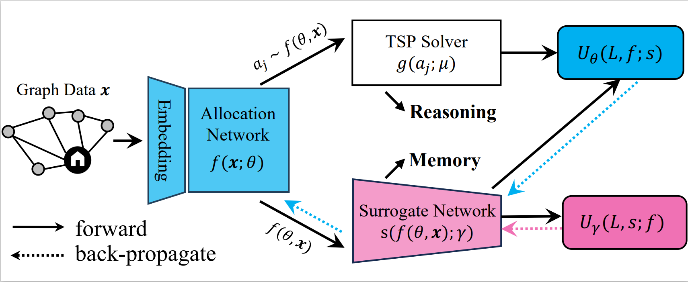
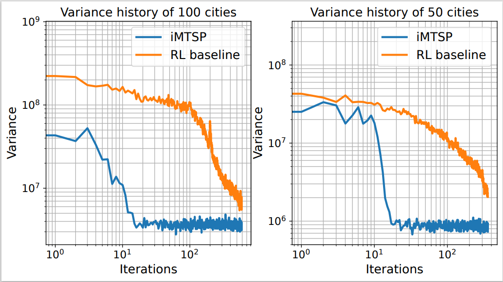

# iMTSP: Solving Min-Max Multiple Traveling Salesman Problem with Imperative Learning

Yifan Guo, Zhongqiang Ren, Chen Wang. "iMTSP: Solving Min-Max Multiple Traveling Salesman Problem with Imperative Learning," IEEE/RSJ International Conference on Intelligent Robots and Systems (IROS), 2024.

iMTSP is a novel self-supervised framework to solve the multiply traveling salesmen problem (MTSP). By introducing a surrogate network as a control variate, iMTSP can efficiently train the allocation network through the non-differentiable TSP solver and the discrete decision space.



We formulate the MTSP as a bilevel optimization problem where the upper-level optimization decomposes MTSP into several small-scale TSPs, and the lower-level speedily solves these TSPs with a heuristic solver.
## Experimental results
The figures demonstrate the advantages of iMTSP on two specific MTSP instances. We compare iMTSP with a reinforcement learning(RL)-based approach and Google OR-Tools routes module.


We also explicitly record the history of gradient variance of iMTSP and the RL baseline. Our method converges 20 times faster than the baseline with the help of the surrogate network.



## To get start
### Dependencies
python == 3.8.15

PyTorch == 1.13.1

torch-geometric == 2.2.0

wandb == 0.15.2

ortools == 9.5.2237

### Generate data for training, validation, and testing
Open data_generator.py, and modify the flag (training, validation, or testing), the number of nodes, and the batch size as needed. Run the script to generate data.

## Training
The validation process is embedded in the training files. 

train.py contains the learning-based baseline.

my_train.py contains the proposed approach.

## Testing
test.py

## More information
Trained models: Please refer to [here](https://github.com/sair-lab/iMTSP/releases/tag/v1.0) for trained allocation networks and corresponding surrogate networks.

## Citation
More details about this work are available in [this paper](https://arxiv.org/abs/2405.00285).
```bibtex
@inproceedings{guo2024imtsp,
  title = {{iMTSP}: Solving Min-Max Multiple Traveling Salesman Problem with Imperative Learning},
  author = {Guo, Yifan and Ren, Zhongqiang and Wang, Chen},
  booktitle = {IEEE/RSJ International Conference on Intelligent Robots and Systems (IROS)},
  year = {2024},
}
```
